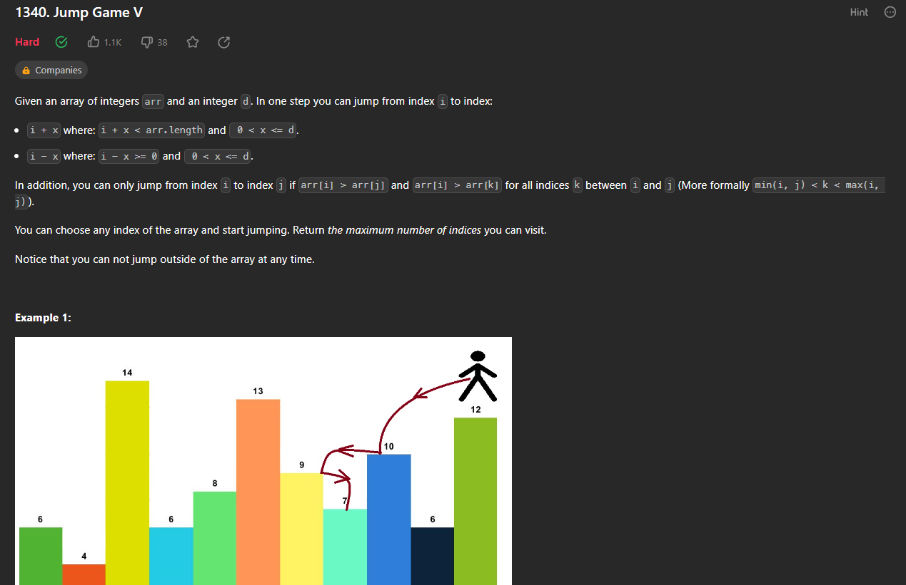
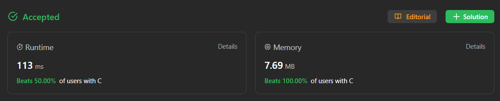

# Exercicios5

**Número da Lista**: 5 
**Conteúdo da Disciplina**: Memoization,  

## Alunos

| Matrícula  | Aluno                       |
| ---------- | --------------------------- |
| 21/1029147 | Arthur de Melo Viana        |
| 21/1029666 | Matheus Henrique Dos Santos |

## Sobre

Exercícios resolvidos no Leetcode:

| Exercício                                                                                                       | Juiz Online                       |           Autor da Resolução            |
| --------------------------------------------------------------------------------------------------------------- | --------------------------------- | :-------------------------------------: |
| [1340 - Jump Game V](https://leetcode.com/problems/jump-game-v/)                   | [Leetcode](https://leetcode.com/) | [Arthur](https://github.com/arthurmlv)  |

## Screenshots

As seções a seguir explicitam os exercícios resolvidos e apresentam uma breve explicação das resoluções. É possível observar o status de conclusão do problema e uma descrição do algoritmo utilizado. A dificuldade dos exercícios do leetcode é dada de forma explícita na página do problema.

### 1340 - Jump Game V (Hard)

Para resolver este exercício, fez-se o uso de um vetor memoization e da lógica de escolher o maior valor possível. Portanto, deve-se considerar cada posição no vetor, e se tal posição será escolhida ou não na solução final, com base no maior valor entre a escolha e a não-escolha. Como cada pulo acresce 1 da resposta, a escolha é sempre `1 + outros pulos`, e a não-escolha é o valor atual.

## Instalação

**Linguagens**: C e Python 

Para rodar os arquivos em C, é recomendado utilizar o WSL caso esteja no Windows. Nele, execute os comandos `sudo apt update` e `sudo apt install build-essential` para instalar o gcc. O código em C também pode ser enviado no próprio [Leetcode](https://leetcode.com/) ou compilado e executado no [Ideone](https://ideone.com/).

Já para rodar os arquivos em Python, pode ser utilizado o interpretador online [GDB](https://www.onlinegdb.com/) ou instalar o Python na sua máquina (as instruções para instalação podem ser encontradas no [guia de instalação](https://wiki.python.org/moin/BeginnersGuide/Download)).

## Uso

Para os códigos em C, compile o código utilizando `gcc -o prog arquivo.c` e execute-o utilizando `./prog`, por fim, digite o input no terminal. Também pode ser utilizado o comando `./prog < entrada.txt` caso exista algum caso de teste válido no arquivo de texto. Os links para os problemas resolvidos estão na seção "Sobre", onde podem ser enviados para verificar se foram aceitos.

Para os códigos em Python, basta digitar `python nome-do-arquivo.py` no terminal de preferência para rodar o código com os casos de testes dados como exemplo. Da mesma forma, a solução pode ser enviada na própria página do problema.

## Vídeo

Para acessar o vídeo explicativo sobre os exercícios, [clique aqui](https://www.youtube.com/embed/).

Para baixar o vídeo, [clique aqui](apresentacao.mp4).
